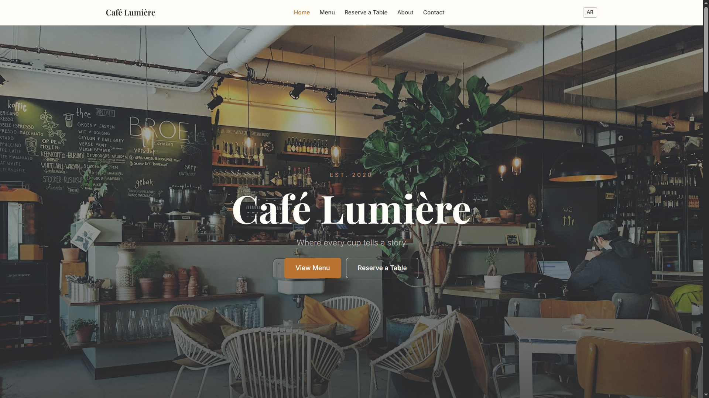
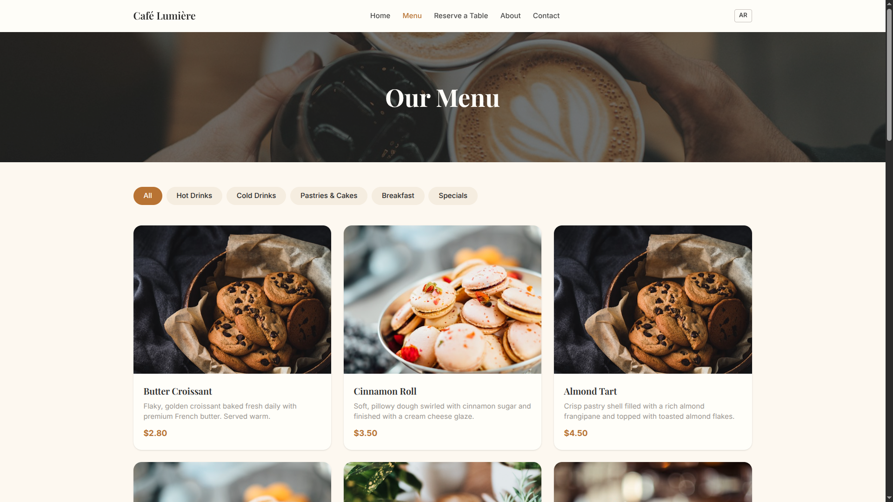
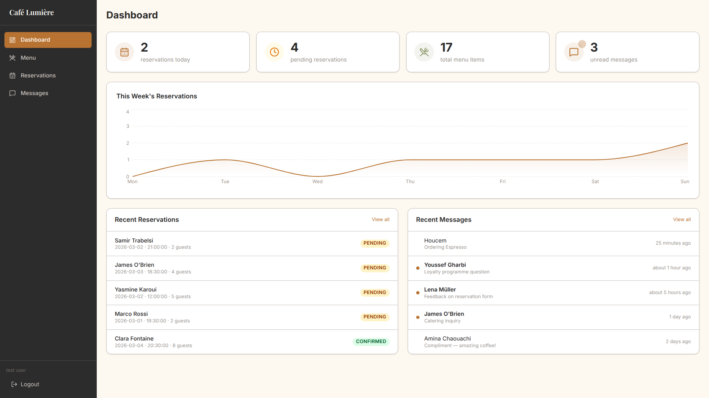
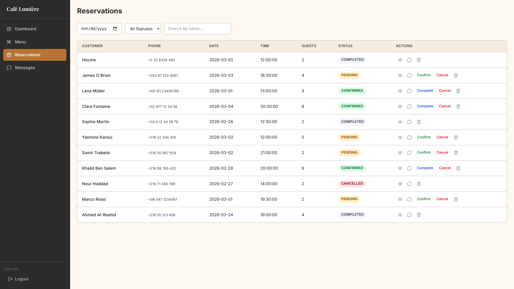
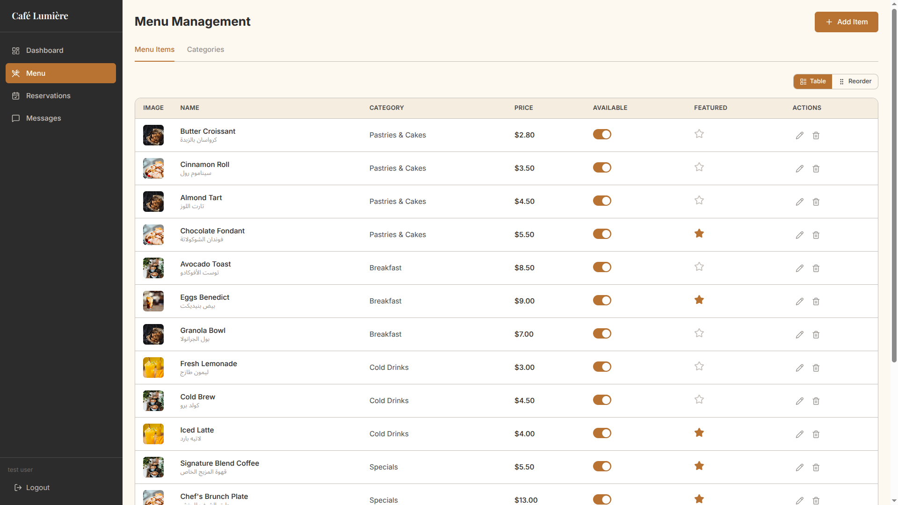
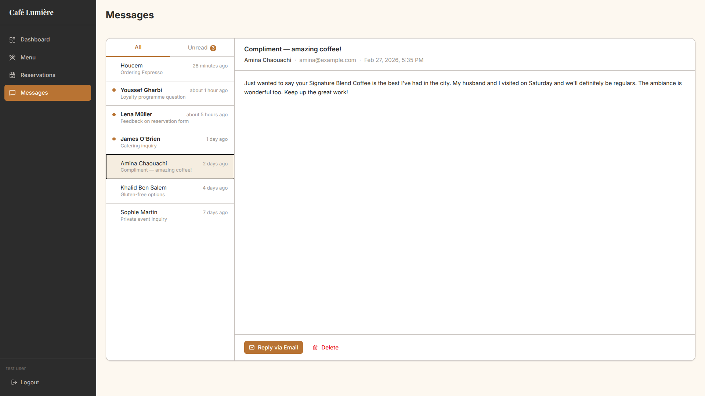
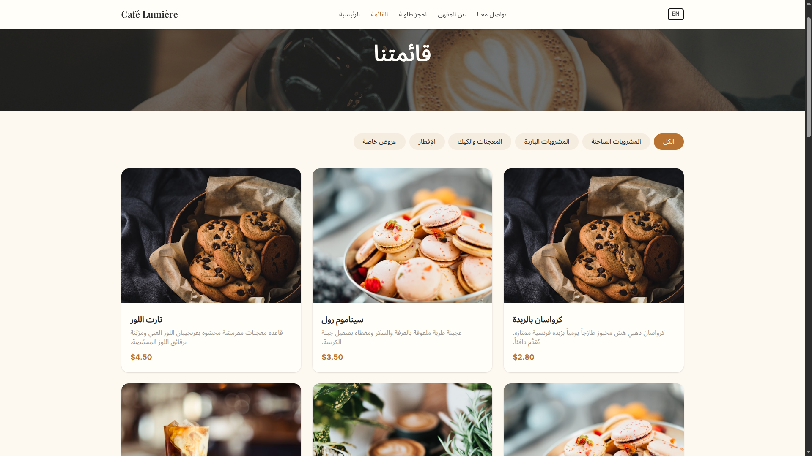
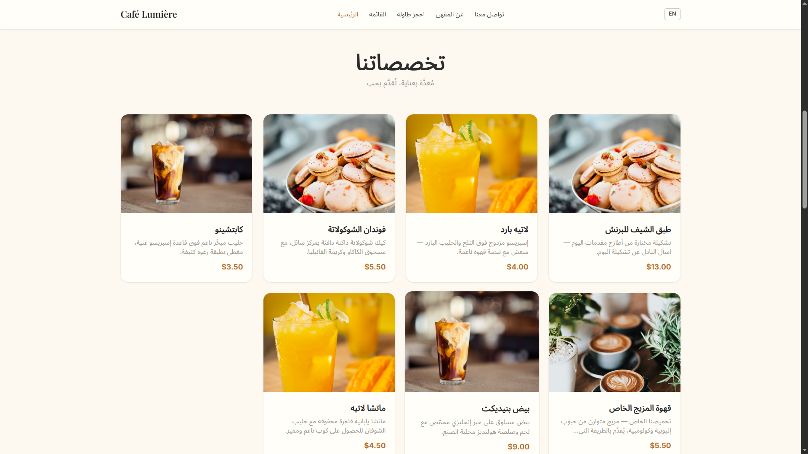

<div align="center">

# Café Lumière

**A full-stack, bilingual restaurant management platform**

.NET 10 · Clean Architecture · React 19 · TypeScript · Tailwind CSS v4 · PostgreSQL

[](https://dotnet.microsoft.com/)
[](https://react.dev/)
[](https://www.typescriptlang.org/)
[](https://www.postgresql.org/)
[](https://tailwindcss.com/)
[](LICENSE)

</div>


## Overview

Café Lumière is a production-ready restaurant web platform combining a premium customer-facing website with a fully functional admin dashboard. It supports bilingual content in **English (LTR)** and **Arabic (RTL)** with automatic layout direction switching.

### Live Website

- **Public:** [cafe-lumiere-eta.vercel.app](https://cafe-lumiere-eta.vercel.app)
- **Admin:** [cafe-lumiere-eta.vercel.app/admin](https://cafe-lumiere-eta.vercel.app/admin)

**Default Admin Credentials**: Seeded automatically on first run:

| Field | Value |
|:------|:------|
| Email | `admin@cafe.com` |
| Password | `Admin123!` |

## Screenshots

| Home | Menu |
|:----:|:----:|
|  |  |

| Admin Dashboard | Reservation Management |
|:---------------:|:----------------------:|
|  |  |

| Menu Management | Messages Inbox |
|:---------------:|:--------------:|
|  |  |

| Arabic — Menu | Arabic — Home |
|:-------------:|:-------------:|
|  |  |

---

## Features

### Customer Website
- **Home**: hero section, featured menu items, testimonials, and location map
- **Menu**: category tabs, item cards with detail modal, bilingual names and descriptions
- **Reservations**: 5-step form (date & time → party size → guest details → confirmation → success) with WhatsApp deep link
- **About**: restaurant story, values, and team section
- **Contact**: contact form + info panel with embedded map

### Admin Panel
- **Dashboard**: stats overview (today's reservations, pending count, total items, unread messages), weekly chart, recent activity feed
- **Menu Management**: full CRUD for items and categories, availability and featured toggles, drag-and-drop reorder
- **Reservation Management**: filterable table (by date and status), inline status updates, detail modal, WhatsApp quick-reply
- **Messages**: two-panel inbox, mark-as-read, delete

---

## Tech Stack

| Layer            | Technologies                                                           |
| ---------------- | ---------------------------------------------------------------------- |
| **Backend**      | .NET 10 / C# 12, ASP.NET Core Web API, PostgreSQL, EF Core 10 + Npgsql |
| **Auth**         | JWT + BCrypt, FluentValidation, Mapster, Scalar (OpenAPI UI)           |
| **Frontend**     | React 19, TypeScript (strict), Vite 7, Tailwind CSS v4, Framer Motion  |
| **Data & Forms** | TanStack Query, React Hook Form + Zod, React Router v7, Axios          |
| **UI / Other**   | i18next, Leaflet, Recharts                                             |
| **Infra**        | Backend → Railway (Docker) · Frontend → Vercel                         |

The backend follows **Clean Architecture** (Domain / Application / Infrastructure / Presentation).

---

## Project Structure

```
cafe-lumiere/
├── backend/
│   ├── Domain/          # Entities, value objects, domain logic
│   ├── Application/     # Use cases, DTOs, interfaces, validators
│   ├── Infrastructure/  # EF Core, repositories, auth, external services
│   └── Presentation/    # ASP.NET Core API controllers & endpoints
├── frontend/
│   └── src/
│       ├── pages/
│       │   ├── public/  # HomePage, MenuPage, ReservationPage, AboutPage, ContactPage
│       │   └── admin/   # LoginPage, DashboardPage, MenuManagement, Reservations, Messages
│       ├── components/  # Reusable UI & feature components
│       ├── services/    # API client (api.ts)
│       ├── contexts/    # AuthContext
│       ├── hooks/       # Custom React hooks
│       ├── types/       # TypeScript interfaces
│       └── utils/       # Constants, helpers, image URLs
├── docs/                # API.md, ARCHITECTURE.md, PRD.md, SRS.md
├── Dockerfile           # Multi-stage build (SDK → ASP.NET runtime)
└── railway.json         # Railway deployment config
```

---

## Getting Started

### Prerequisites
- [.NET 10 SDK](https://dotnet.microsoft.com/download)
- [Node.js 20+](https://nodejs.org) (or Bun)
- PostgreSQL instance

### Backend

```bash
# Navigate to the Presentation layer
cd backend/Presentation

# Create a .env file with the required variables (see Environment Variables)
cp .env.example .env

# Restore dependencies & apply migrations
dotnet restore
dotnet ef database update

# Run the API
dotnet run
# API available at http://localhost:5258
# OpenAPI UI at http://localhost:5258/scalar/
```

### Frontend

```bash
cd frontend

# Install dependencies
npm install

# Start the dev server (proxies /api to http://localhost:5258)
npm run dev
# App available at http://localhost:5173
```


## Environment Variables

### Backend (`backend/Presentation/.env`)

| Variable               | Description                                 |
| ---------------------- | ------------------------------------------- |
| `DEFAULTCONNECTION`    | PostgreSQL connection string                |
| `JWT_SECRET_KEY`       | JWT signing secret                          |
| `JWT_ISSUER`           | JWT issuer URL                              |
| `JWT_AUDIENCE`         | JWT audience URL                            |
| `JWT_LIFETIME_MINUTES` | Token expiry in minutes                     |
| `CORS_ORIGIN`          | Allowed frontend origin (no trailing slash) |

### Frontend

| Variable | Description |
|---|---|
| `VITE_API_URL` | Backend API base URL (production) |


## Deployment

| Service | Platform | Config |
|---|---|---|
| Backend | Railway | `Dockerfile` · `railway.json` |
| Frontend | Vercel | `frontend/vercel.json` (SPA rewrite rule) |

The Dockerfile uses a multi-stage build: compiles with the .NET SDK image, then runs on the lighter ASP.NET runtime image on port `8080`.


## Documentation

| Document | Description |
|:---------|:------------|
| [PRD.md](docs/PRD.md) | Product Requirements — personas, functional requirements, user stories, success metrics |
| [SRS.md](docs/SRS.md) | Software Requirements Specification (IEEE 830) — requirements with traceable IDs, data model, acceptance criteria |
| [ARCHITECTURE.md](docs/ARCHITECTURE.md) | System design — Clean Architecture breakdown, auth flow, deployment topology, technology decisions |
| [API.md](docs/API.md) | Full API reference — all endpoints with request/response schemas and TypeScript types |

## License

MIT © 2026 [Hocine Bechebil](https://github.com/hocine-bechebil)
